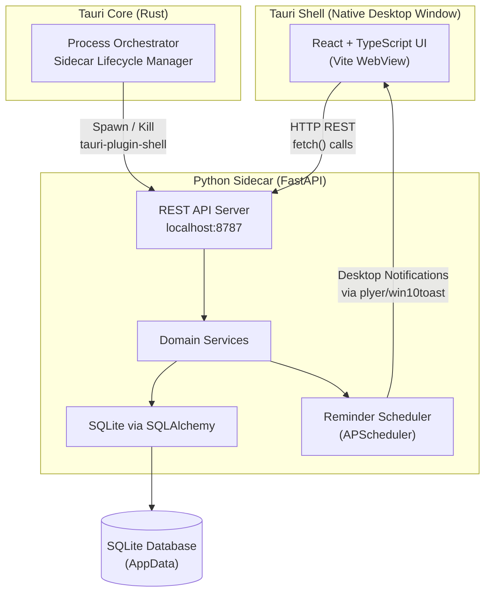
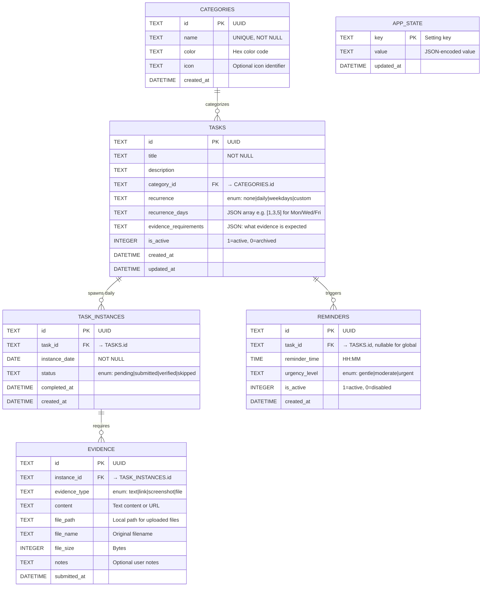
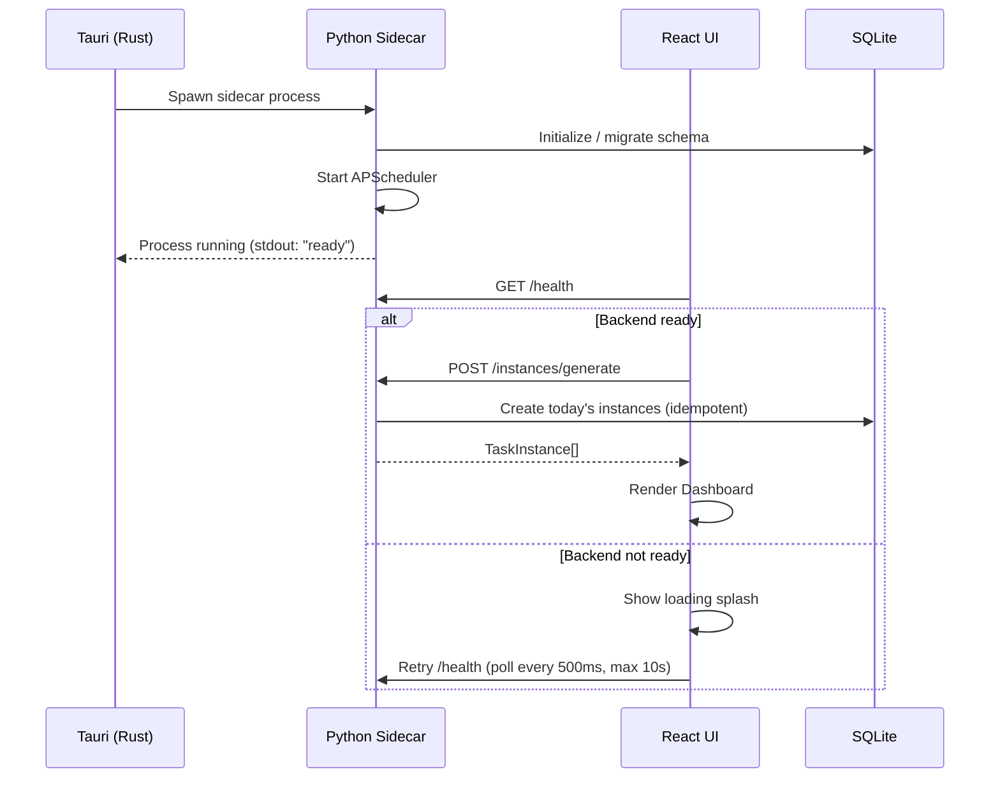
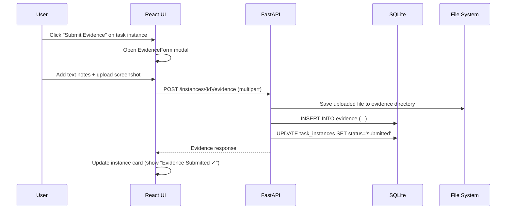
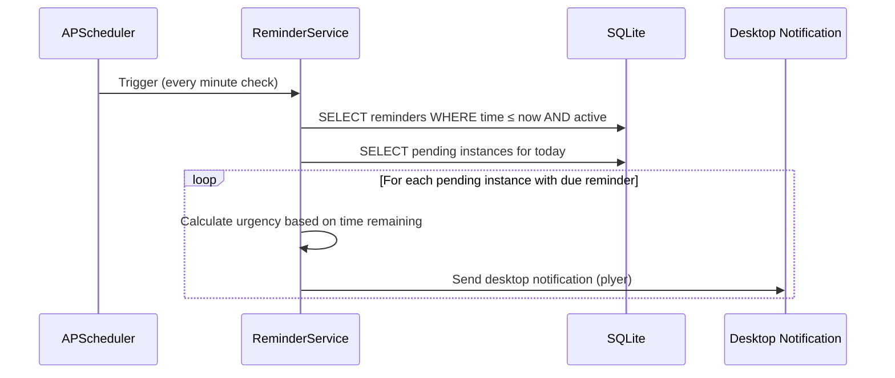

# Project Verdict — Phase 1 Architecture Document

## 1. Philosophy & Problem Statement

Project Verdict exists to close the **intention-action gap**. The user declares goals, the system demands evidence. A task is not "done" because the user clicked a button — it is done when proof exists.

This Phase 1 MVP delivers a fully usable **accountability loop**:

```
Declare Task → Get Reminded → Submit Evidence → Review Verdict
```

Every design decision below serves this loop. Nothing more.

---

## 2. Overall Architecture



### Why This Shape?

| Layer | Technology | Rationale |
|---|---|---|
| **Desktop Shell** | Tauri v2 (Rust) | Tiny binary (~5MB), native window, no Electron bloat. Rust handles process lifecycle only — no business logic. |
| **Frontend** | React + TypeScript + Vite | Standard, well-supported by Tauri scaffolding. TypeScript catches bugs at compile time. Vite provides fast HMR. |
| **Backend** | Python + FastAPI | Your domain expertise is in Python. FastAPI gives async REST with auto-generated OpenAPI docs. Python unlocks future AI/ML phases trivially. |
| **Database** | SQLite (via SQLAlchemy) | Zero-config, file-based, single-user. Perfect for local-first. SQLAlchemy gives us ORM + migration path (Alembic). |
| **Communication** | HTTP REST over localhost | Simple, debuggable (curl, Postman), no custom IPC protocol. Frontend uses standard `fetch()`. |

> [!IMPORTANT]
> The Python backend runs as a **sidecar process** — a standalone executable bundled inside the Tauri app. During development, we run it as a normal Python process. For distribution, we'll compile it with PyInstaller.

---

## 3. Folder Structure

```
Project Verdict/
├── src/                          # React frontend
│   ├── assets/                   # Fonts, icons, global images
│   ├── components/               # Shared UI components
│   │   ├── ui/                   # Primitives (Button, Input, Card, Modal)
│   │   └── layout/               # Shell, Sidebar, TopBar
│   ├── features/                 # Feature modules (core pattern)
│   │   ├── dashboard/            # Daily dashboard view
│   │   │   ├── components/       # Dashboard-specific components
│   │   │   ├── hooks/            # useTodaysTasks, useDashboardStats
│   │   │   └── index.ts          # Public exports
│   │   ├── tasks/                # Task CRUD
│   │   │   ├── components/       # TaskCard, TaskForm, TaskList
│   │   │   ├── hooks/            # useTasks, useCreateTask
│   │   │   ├── types.ts          # Task interfaces
│   │   │   └── index.ts
│   │   ├── evidence/             # Evidence submission
│   │   │   ├── components/       # EvidenceForm, EvidenceViewer
│   │   │   ├── hooks/            # useSubmitEvidence
│   │   │   └── index.ts
│   │   └── reminders/            # Reminder configuration
│   │       ├── components/       # ReminderSettings
│   │       ├── hooks/
│   │       └── index.ts
│   ├── hooks/                    # Global hooks (useApi, useNotification)
│   ├── lib/                      # API client, utilities
│   │   └── api.ts                # Centralized fetch wrapper
│   ├── store/                    # Zustand stores (UI-only state)
│   ├── types/                    # Global TypeScript types
│   ├── App.tsx
│   ├── App.css
│   ├── index.css                 # Design system tokens
│   └── main.tsx
│
├── src-tauri/                    # Tauri (Rust) shell
│   ├── src/
│   │   ├── lib.rs                # App setup, sidecar management
│   │   └── main.rs               # Desktop entry point (calls lib.rs)
│   ├── binaries/                 # PyInstaller output goes here (prod)
│   ├── capabilities/             # Tauri v2 security permissions
│   ├── icons/                    # App icons
│   ├── tauri.conf.json
│   └── Cargo.toml
│
├── backend/                      # Python FastAPI backend
│   ├── app/
│   │   ├── __init__.py
│   │   ├── main.py               # FastAPI app entry, CORS, lifespan
│   │   ├── config.py             # Settings (DB path, port, etc.)
│   │   ├── database.py           # SQLAlchemy engine, session factory
│   │   ├── models/               # SQLAlchemy ORM models
│   │   │   ├── __init__.py
│   │   │   ├── task.py           # Task, Category models
│   │   │   ├── task_instance.py  # DailyTaskInstance model
│   │   │   └── evidence.py       # Evidence model
│   │   ├── schemas/              # Pydantic request/response schemas
│   │   │   ├── __init__.py
│   │   │   ├── task.py
│   │   │   ├── task_instance.py
│   │   │   └── evidence.py
│   │   ├── routers/              # API route handlers
│   │   │   ├── __init__.py
│   │   │   ├── tasks.py
│   │   │   ├── instances.py
│   │   │   ├── evidence.py
│   │   │   └── health.py
│   │   ├── services/             # Business logic layer
│   │   │   ├── __init__.py
│   │   │   ├── task_service.py
│   │   │   ├── instance_service.py
│   │   │   ├── evidence_service.py
│   │   │   └── reminder_service.py
│   │   └── utils/
│   │       ├── __init__.py
│   │       └── scheduler.py      # APScheduler setup
│   ├── alembic/                  # Database migrations
│   │   ├── env.py
│   │   └── versions/
│   ├── alembic.ini
│   ├── requirements.txt
│   └── pyproject.toml
│
├── shared/                       # Shared constants (category names, etc.)
│   └── constants.json
│
├── package.json
├── tsconfig.json
├── vite.config.ts
└── README.md
```

### Why Feature-First on Frontend?

A `features/` folder groups related components, hooks, and types by **domain concept** (tasks, evidence, dashboard) rather than by file type. This means:
- Adding a new feature = adding one folder, not touching 6 different directories
- Deleting a feature = removing one folder
- Each feature is a self-contained unit that can evolve independently

### Why Separate `services/` on Backend?

Routers handle HTTP concerns (parsing requests, returning responses). Services contain **business logic** (creating task instances, validating evidence). This separation means:
- Business logic is testable without HTTP
- Future phases (CLI, AI agents) can call services directly
- Routers stay thin and readable

---

## 4. Database Schema



### Schema Design Decisions

| Decision | Rationale |
|---|---|
| **UUIDs as primary keys** | No auto-increment conflicts. Safe for future sync/export. Generated client-side if needed. |
| **`TASK_INSTANCES` is the heartbeat** | A recurring task creates a new instance each day. Completion status, evidence — everything attaches to the *instance*, not the master task. This is the core architectural insight. |
| **`status` on instances, not a boolean** | `pending → submitted → verified → skipped` gives us a state machine. Phase 2+ can add AI verification without schema changes. |
| **`evidence_requirements` as JSON** | Flexible. A task can require "at least one screenshot" or "a link + notes". Stored as structured JSON for future programmatic validation. |
| **`APP_STATE` key-value table** | Stores app preferences (theme, default reminder times, last sync date) without creating a table for every setting. |
| **`recurrence_days` as JSON** | Supports arbitrary day patterns beyond simple daily/weekdays. |

### Unique Constraints

```sql
-- A task can only have ONE instance per day
UNIQUE(task_id, instance_date) ON TASK_INSTANCES
```

---

## 5. Data Models (TypeScript & Pydantic)

### TypeScript Interfaces (Frontend)

```typescript
// === Core Domain Types ===

type RecurrenceType = 'none' | 'daily' | 'weekdays' | 'custom';
type InstanceStatus = 'pending' | 'submitted' | 'verified' | 'skipped';
type EvidenceType   = 'text' | 'link' | 'screenshot' | 'file';
type UrgencyLevel   = 'gentle' | 'moderate' | 'urgent';

interface Category {
  id: string;
  name: string;
  color: string;
  icon?: string;
}

interface Task {
  id: string;
  title: string;
  description?: string;
  categoryId?: string;
  category?: Category;
  recurrence: RecurrenceType;
  recurrenceDays?: number[];
  evidenceRequirements?: Record<string, any>;
  isActive: boolean;
  createdAt: string;
  updatedAt: string;
}

interface TaskInstance {
  id: string;
  taskId: string;
  task?: Task;
  instanceDate: string;       // "YYYY-MM-DD"
  status: InstanceStatus;
  evidence: Evidence[];
  completedAt?: string;
  createdAt: string;
}

interface Evidence {
  id: string;
  instanceId: string;
  evidenceType: EvidenceType;
  content?: string;
  filePath?: string;
  fileName?: string;
  fileSize?: number;
  notes?: string;
  submittedAt: string;
}

interface Reminder {
  id: string;
  taskId?: string;
  reminderTime: string;       // "HH:MM"
  urgencyLevel: UrgencyLevel;
  isActive: boolean;
}
```

### Pydantic Schemas (Backend)

```python
# Mirrors the TypeScript interfaces with snake_case
# Uses Pydantic v2 model_config for JSON aliasing

class TaskCreate(BaseModel):
    title: str
    description: str | None = None
    category_id: str | None = None
    recurrence: RecurrenceType = RecurrenceType.NONE
    recurrence_days: list[int] | None = None
    evidence_requirements: dict | None = None

class TaskResponse(BaseModel):
    id: str
    title: str
    description: str | None
    category_id: str | None
    category: CategoryResponse | None
    recurrence: RecurrenceType
    recurrence_days: list[int] | None
    evidence_requirements: dict | None
    is_active: bool
    created_at: datetime
    updated_at: datetime

    model_config = ConfigDict(from_attributes=True)
```

---

## 6. API Contracts

Base URL: `http://127.0.0.1:8787/api/v1`

> [!NOTE]
> All endpoints are versioned under `/api/v1`. This lets us evolve the API in future phases without breaking the existing frontend.

### Health

| Method | Endpoint | Purpose |
|---|---|---|
| `GET` | `/health` | Backend readiness check |

### Categories

| Method | Endpoint | Purpose | Request Body | Response |
|---|---|---|---|---|
| `GET` | `/categories` | List all categories | — | `Category[]` |
| `POST` | `/categories` | Create category | `{ name, color, icon? }` | `Category` |
| `PUT` | `/categories/{id}` | Update category | `{ name?, color?, icon? }` | `Category` |
| `DELETE` | `/categories/{id}` | Delete category | — | `204` |

### Tasks

| Method | Endpoint | Purpose | Request Body | Response |
|---|---|---|---|---|
| `GET` | `/tasks` | List all active tasks | — | `Task[]` |
| `GET` | `/tasks/{id}` | Get task details | — | `Task` |
| `POST` | `/tasks` | Create task | `TaskCreate` | `Task` |
| `PUT` | `/tasks/{id}` | Update task | `TaskUpdate` | `Task` |
| `DELETE` | `/tasks/{id}` | Soft-delete (archive) task | — | `204` |

### Task Instances (Daily)

| Method | Endpoint | Purpose | Query Params | Response |
|---|---|---|---|---|
| `GET` | `/instances` | List instances | `?date=YYYY-MM-DD` | `TaskInstance[]` |
| `GET` | `/instances/{id}` | Get instance with evidence | — | `TaskInstance` |
| `POST` | `/instances/generate` | Generate today's instances | `{ date?: "YYYY-MM-DD" }` | `TaskInstance[]` |
| `PATCH` | `/instances/{id}/skip` | Mark instance as skipped | `{ reason? }` | `TaskInstance` |

> [!IMPORTANT]
> **`POST /instances/generate`** is the critical endpoint. The frontend calls this on app startup (and at midnight). It looks at all active recurring tasks and creates instances for today if they don't already exist. This is **idempotent** — calling it twice for the same date produces no duplicates.

### Evidence

| Method | Endpoint | Purpose | Request Body | Response |
|---|---|---|---|---|
| `POST` | `/instances/{id}/evidence` | Submit evidence | `multipart/form-data` | `Evidence` |
| `GET` | `/instances/{id}/evidence` | List evidence for instance | — | `Evidence[]` |
| `DELETE` | `/evidence/{id}` | Remove evidence | — | `204` |

Evidence submission uses `multipart/form-data` to support file uploads alongside text fields.

### Reminders

| Method | Endpoint | Purpose | Request Body | Response |
|---|---|---|---|---|
| `GET` | `/reminders` | List all reminders | — | `Reminder[]` |
| `POST` | `/reminders` | Create reminder | `ReminderCreate` | `Reminder` |
| `PUT` | `/reminders/{id}` | Update reminder | `ReminderUpdate` | `Reminder` |
| `DELETE` | `/reminders/{id}` | Delete reminder | — | `204` |

### Dashboard

| Method | Endpoint | Purpose | Response |
|---|---|---|---|
| `GET` | `/dashboard/today` | Today's summary | `DashboardResponse` |

```typescript
interface DashboardResponse {
  date: string;
  totalTasks: number;
  completedTasks: number;
  pendingTasks: number;
  skippedTasks: number;
  completionRate: number;         // 0.0 - 1.0
  instances: TaskInstance[];       // Full instance list with evidence
  streaks: Record<string, number>; // taskId → consecutive days
}
```

---

## 7. Data Flow

### Flow 1: App Startup



### Flow 2: Evidence Submission



### Flow 3: Reminder Engine



---

## 8. State Management Strategy

### Frontend State Architecture

```
┌─────────────────────────────────────────────────┐
│                  React Frontend                  │
├──────────────────┬──────────────────────────────┤
│   UI State       │   Server State               │
│   (Zustand)      │   (TanStack Query)           │
│                  │                              │
│ • Sidebar open   │ • Tasks list                 │
│ • Active tab     │ • Today's instances          │
│ • Modal state    │ • Evidence data              │
│ • Theme          │ • Dashboard stats            │
│ • Form drafts    │ • Reminders config           │
└──────────────────┴──────────────────────────────┘
```

| Concern | Tool | Why |
|---|---|---|
| **Server/API state** | TanStack Query (React Query) | Automatic caching, background refetching, optimistic updates, loading/error states. This is data from the Python backend. |
| **UI-only state** | Zustand | Minimal boilerplate, no providers, simple API. For things like "is the sidebar open" or "which modal is showing". |

> [!TIP]
> We intentionally do NOT put API data into Zustand. TanStack Query owns the cache for all backend data. Zustand only holds ephemeral UI state. This is the 2025 best practice and prevents cache-sync bugs.

---

## 9. Reminder Engine Design

The reminder system runs **inside the Python backend** using APScheduler (AsyncIO scheduler).

### Escalating Urgency Model

```
Morning (configurable):   "gentle"   → Friendly nudge notification
Midday:                   "moderate" → Firmer reminder with pending count
Evening (configurable):   "urgent"   → Strong warning, day is ending
```

### Implementation

```python
# Pseudo-code for the reminder service

class ReminderService:
    def check_and_notify(self):
        pending = self.get_pending_instances_for_today()
        if not pending:
            return

        current_hour = datetime.now().hour
        urgency = self.calculate_urgency(current_hour)

        for instance in pending:
            if self.should_remind(instance, urgency):
                self.send_notification(
                    title=f"Project Verdict — {urgency.upper()}",
                    message=f"'{instance.task.title}' needs evidence!",
                    urgency=urgency
                )
```

### Notification Delivery

- **Phase 1**: Use `plyer` (cross-platform Python notifications) or `win10toast-reborn` for Windows-native toast notifications.
- **Future**: Tauri's native notification API via IPC events.

---

## 10. File Storage Strategy

Evidence files (screenshots, attachments) are stored locally:

```
%APPDATA%/project-verdict/
├── data/
│   └── verdict.db           # SQLite database
├── evidence/
│   └── 2026-06-22/          # Organized by date
│       ├── {instance_id}/
│       │   ├── screenshot_1.png
│       │   └── solution.py
│       └── ...
└── logs/
    └── backend.log
```

The `file_path` column in the `evidence` table stores the **relative path** from the app data root, making the data portable.

---

## 11. Future Extensibility

This architecture is designed to evolve. Here's how each future phase plugs in:

| Future Phase | Extension Point | What Changes |
|---|---|---|
| **AI Verification** | Add `verification_service.py`, new `status` transition: `submitted → verified/rejected` | New service, no schema change |
| **Git Tracking** | Add `git_service.py`, new evidence type `git_commit` | New service + 1 enum value |
| **Leetcode Verification** | Add `leetcode_service.py`, auto-create evidence from API | New service only |
| **Browser Activity** | Add `activity_service.py`, new evidence type `browser_session` | New service + 1 enum value |
| **Desktop Mascot** | Separate Tauri window, reads from same `/dashboard/today` API | No backend changes |
| **Mobile Companion** | FastAPI already serves REST — mobile app connects to same API (with auth layer added) | Add auth middleware |
| **AI Daily Verdicts** | Add `verdict_service.py`, new `daily_verdicts` table | New service + 1 table |

> [!NOTE]
> The `status` enum on `TASK_INSTANCES` and the `evidence_type` enum on `EVIDENCE` are the primary extension points. Every future integration is essentially "a new way to create evidence" or "a new way to verify it."

---

## 12. Development Roadmap (Phase 1 Sub-Phases)

We build incrementally, one module at a time, each one **fully usable** before moving to the next.

### Sub-Phase 1A: Foundation (Backend Skeleton + DB)
- [ ] Initialize Python backend with FastAPI
- [ ] Set up SQLAlchemy models + SQLite
- [ ] Implement database migration setup (Alembic)
- [ ] Create health endpoint
- [ ] Set up Tauri v2 project with React + TypeScript
- [ ] Establish sidecar communication (health check)
- [ ] Design system: CSS tokens, base components

**Deliverable**: App launches, Tauri spawns Python, frontend shows "Backend Connected ✓"

---

### Sub-Phase 1B: Task Management
- [ ] CRUD API for Categories
- [ ] CRUD API for Tasks (with recurrence config)
- [ ] Frontend: Task creation form
- [ ] Frontend: Task list with category filters
- [ ] Frontend: Task edit/delete

**Deliverable**: User can create, edit, delete tasks with categories and recurrence settings

---

### Sub-Phase 1C: Daily Instance Engine
- [ ] Instance generation service (idempotent)
- [ ] Dashboard API endpoint
- [ ] Frontend: Daily dashboard view
- [ ] Frontend: Instance cards showing status
- [ ] Auto-generate on app startup

**Deliverable**: Opening the app shows today's tasks. Recurring tasks auto-appear each day.

---

### Sub-Phase 1D: Evidence Submission
- [ ] Evidence upload API (multipart)
- [ ] File storage service
- [ ] Frontend: Evidence submission modal
- [ ] Frontend: Evidence viewer (view submitted proof)
- [ ] Instance status transitions (pending → submitted)

**Deliverable**: User can submit text, links, screenshots, files as evidence. Task cards show evidence status.

---

### Sub-Phase 1E: Reminders + Polish
- [ ] APScheduler integration
- [ ] Reminder CRUD API
- [ ] Desktop notification service
- [ ] Frontend: Reminder configuration UI
- [ ] Escalating urgency logic
- [ ] Polish: Animations, transitions, empty states
- [ ] Error handling + loading states throughout

**Deliverable**: Full MVP loop is complete. App reminds user, user submits evidence, dashboard shows truth.

---

## User Review Required

> [!IMPORTANT]
> ### Architecture Decision: Python Sidecar Pattern
> The Python backend runs as a **separate process** (sidecar) that Tauri spawns. The frontend talks to it via HTTP on `localhost:8787`. This is the production-recommended pattern for Tauri + Python. During development, you'll run the Python server manually (`uvicorn`) and the Tauri dev server separately. Are you comfortable with this two-process development workflow?

> [!IMPORTANT]
> ### State Management Choice
> I'm recommending **Zustand** (for UI state like sidebar/modal toggles) + **TanStack Query** (for all backend data). This is the simplest maintainable solution per your requirements. Zustand has near-zero boilerplate and TanStack Query eliminates manual cache management. Does this align with your expectations?

> [!IMPORTANT]
> ### Notification Library
> For Phase 1 desktop notifications, I plan to use Python's `plyer` library (cross-platform) or `win10toast-reborn` (Windows-native). These fire OS-level toast notifications. In a future phase, we could switch to Tauri's native notification plugin for tighter integration. Acceptable for MVP?

## Open Questions

> [!WARNING]
> ### Default Categories
> Should I pre-seed the database with default categories matching your use case (e.g., "Leetcode", "AI/ML Learning", "Projects", "Upskilling")? Or do you want the app to start blank and let you create categories?

> [!WARNING]
> ### Evidence File Size Limits
> Should we enforce a maximum file size for evidence uploads? Screenshots and small files are expected, but should we cap at, say, 10MB per file to prevent the database directory from growing too large?

> [!WARNING]
> ### Task Archival vs Hard Delete
> Currently, deleting a task **archives** it (soft delete, `is_active = 0`). This preserves historical data and streaks. Should tasks ever be truly deletable, or is archival always the right behavior?
